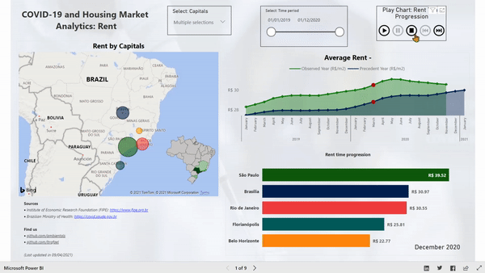

# Rafael's Portfolio
This is my personal portfolio for data science and data analysis projects. For more information, inquiries or suggestions please use the email: rafaellt3@gmail.com or contact me via [linkedin](https://www.linkedin.com/in/rafaellt/).

## [Detecting Credit Card Fraud with Machine Learning](https://github.com/ltrafael/credit_fraud_detection)

This is an on-going project to develop machine learning solutions to identify fraudulent transactions in a dataset containing 285,000 transactions in a 2 day period. The transactions belong to European cardholders.

Some of the challenges found with this problem were:
- Extreme class imbalance: fraudulent transactions correspond to 0.17% of the dataset. This is dealt with utilizing over and under-sampling techniques such as SMOTE, TomekLinks and random under sampler;
- Privacy and confidentiality: to prevent recognizing individuals from the data, it was made available after transformations that create new numerical columns based on the original ones, meaning no further interpretation can be made from the data;
- Concept drift: it happens when one or more characteristics of the data is subject to change over time. It can happen in many forms, gradual or sudden, single event or reoccuring. If not dealt with, it can significantly affect the performance of models and understanding of behavior.

Initial results with the model Random Forest Classifier show that **76%** of frauds can be detected, translating to an estimate of **6.5 million Euros in annual savings**.

## [Covid x Housing market in Brazil Part 1/2](https://github.com/ltrafael/The-Impact-of-the-Pandemic-on-the-Housing-Market-in-Brazil)
This project was made in collaboration with [Talles](https://www.linkedin.com/in/talles-di-cunto/). We analyzed COVID-19 and housing market data using Python and Power BI. You can read the Medium post [here](https://lnkd.in/e_Dk4EH). The two main questions answered here are:
1. How did the pandemic behave in Brazilian capitals and on a national level?
2. How did the housing market behave before and during the pandemic period?

Some of the insights we extracted from the data are:
- The impacts of the pandemic were accentuated in bigger cities;
- In 2020, residential rentability went down in most of the analyzed capitals;
- There are mostly moderate and strong correlations between COVID and housing variables.

## [Analyzing student performance (pt-br)](https://github.com/ltrafael/-Educational-analysis-on-Student-Performance)
Educational analysis of student performance, this was done as part of the specialization/certificate course on data science. Contains detailed explanation of different data munging/wrangling methods and visualizations, such as:
- encoding
- discretization
- scaling, standardization and normalization
- detecting and dealing with missing values
- detecting and dealing with outliers
- validation
- feature selection
- correlation
- visualization plots

## [GDP Indicators in the USA](https://github.com/ltrafael/GDP-Indicators-in-the-USA)
Simple report made as practice, using GDP and population data for all USA states. Enables the selection of desired states for quick comparison. 
- Analysis of GDP, population and GDP per capita from 1997 until 2015
- Comparison between all states for the 3 variables
- Comparison of growth rates for each variable
- States with highest GDP per capita increase in this period (Way to go North Dakota!)

